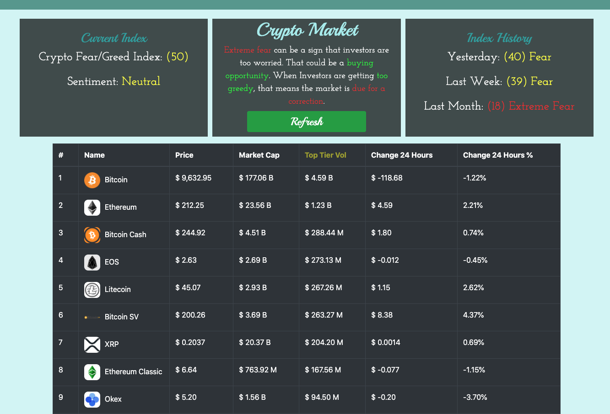

# Crypto Market Trading View

A front-end JavaScript application that allows users to view the top 50 crypto currency by top trading volumes and a fear/greed index to view current and past market sentiments.

### Technologies Used
- JavaScript ES5
- HTML 5
- CSS 3
- Bootstrap 4
- jQuery

### Live Demo

Try the application live at ...

### Features
- Users can view the top 50 crypto assets based on top volumes.
- User can view the pirce, marketcap, changes in 24 hours, changes in 24 hours percentage, and top tier volume.
- User can grasp the market sentiment by seeing the market sentiment through the fear/greed index.
- User can press the refresh button to get the latest update on price without having to refresh the whole page
- User can view the fear/greed index color coded based on market sentiment.

### Previews

### Getting Started
1. Clone the repository

git clone https://github.com/Frank-Bae/crypto_market.git

2. Open the file through a code editor and open default browser from index.html file.
